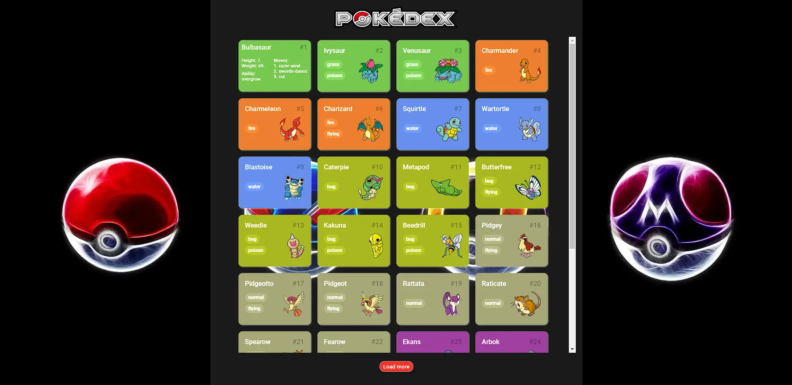

<h1 align="center"> Pokedex API </h1>

Este projeto foi desenvoldido para práticas em JavaScript, através do consumo de uma API REST. 

  <a href="#-tecnologias">Tecnologias</a>&nbsp;&nbsp;&nbsp;|&nbsp;&nbsp;&nbsp;
  <a href="#-projeto">Projeto</a>&nbsp;&nbsp;&nbsp;
  

 

  

## 🚀 Tecnologias

Esse projeto foi desenvolvido com as seguintes tecnologias:

- HTML e CSS
- JavaScript
- Git e Github
- API REST

## 💻 Projeto

O projeto base foi desenvolvido durante o curso, adicionei algumas modificações, redesign e novas funcionalidades propostas como desafio, consumindo novas informações da API pra gerar uma nova lista no verso do card principal através de efeito hover.

- [Acesse o projeto](https://gabtech1.github.io/Pokedex-API/)

---

Feito através do bootcamp da DIO Potência tech Angular developer by iFood 📚